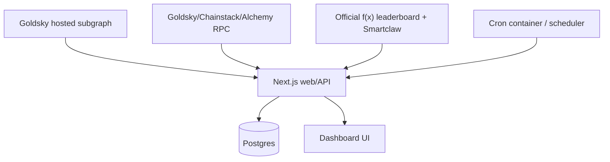

# fx-trader-profiles

A self-hostable trader-profile dashboard for f(x) Protocol wallets.

The MVP is designed to use a **hosted subgraph/indexer** for Ethereum event indexing and self-host the rest of the stack: Next.js web/API server, Postgres, cron job caller, backups, and Watchtower-based app image updates.

## Current status

This repository is currently a **Phase 0 scaffold**. It includes:

- A Next.js App Router web app shell under `apps/web`.
- Placeholder pages for home, leaderboard, trader profile, position detail, and methodology.
- `/api/health` with Postgres connectivity checks.
- Protected placeholder job endpoints for cron-triggered workers.
- Docker Compose for Postgres, web, cron, backups, and Watchtower.
- Self-host setup and monitoring scripts.
- A detailed implementation plan in `docs/fx-user-tracker-research.md`.

It does **not** yet include production contract discovery, real leaderboard ingestion, subgraph deployment, position syncing, enrichment, or trader-metric computation.

## Architecture



### Self-hosted components

- Next.js web/API server
- Postgres
- Cron caller
- Postgres backups
- Watchtower
- Reverse proxy/TLS on your host, if needed

### Hosted/managed MVP dependencies

- Goldsky hosted subgraph for Ethereum event indexing
- RPC providers for targeted reads only
- Optional seed/comparison APIs, such as Smartclaw and the official f(x) leaderboard API if discoverable and allowed

## Repository layout

```text
apps/web/                  Next.js app and API routes
infra/self-host/           Self-host environment template
docs/                      Research/specification documents
scripts/                   Self-host setup and monitoring helpers
docker-compose.yml         Self-hosted runtime stack
pnpm-workspace.yaml        pnpm workspace definition
```

## Local development

### Requirements

- Node.js 22+
- pnpm 10+
- Optional: Docker + Docker Compose v2 for self-host stack testing

### Install

```bash
pnpm install
```

### Run web app locally

```bash
pnpm dev
```

The app listens on <http://localhost:3000>.

### Build

```bash
pnpm build
```

### Test

```bash
pnpm test
```

There are no meaningful unit tests yet; this command currently verifies the Node test runner wiring.

## Self-hosted Docker stack

### 1. Create environment file

```bash
cp infra/self-host/.env.example .env
```

Edit `.env` before production use:

- Replace `POSTGRES_PASSWORD` and update `DATABASE_URL` to match.
- Set hosted indexer/RPC variables when available.
- Set `CRON_SECRET`, or let `scripts/self-host-setup.sh` generate it.
- Keep `WEB_BIND_HOST=127.0.0.1` if using a host reverse proxy.

### 2. Start the stack

```bash
scripts/self-host-setup.sh
```

The setup script builds the local web image, pulls support images, starts Postgres, starts the web/API container, starts cron, starts backups, and starts Watchtower.

### 3. Monitor the stack

```bash
scripts/self-host-monitor.sh
```

The monitor script checks:

- Docker Compose service state
- container health status
- Postgres readiness
- web `/api/health`
- resource usage snapshot

### 4. Useful compose commands

```bash
docker compose ps
docker compose logs -f web
docker compose logs -f cron
docker compose exec postgres psql -U fx_trader_profiles -d fx_trader_profiles
docker compose down
docker compose up -d --build
```

## Environment variables

See:

- `.env.example` for local app defaults
- `infra/self-host/.env.example` for Docker/self-host defaults

Important rules:

1. Never expose RPC/indexer keys to the browser.
2. Never commit `.env`.
3. Cron routes require `CRON_SECRET` in production.
4. External snapshots must store source, fetched time, and payload hash once ingestion is implemented.

## API routes currently available

| Route | Status | Purpose |
| --- | --- | --- |
| `GET /api/health` | implemented | Checks app, Postgres connectivity, and subgraph configuration. |
| `POST /api/jobs/snapshot-leaderboard` | placeholder | Future leaderboard snapshot worker trigger. |
| `POST /api/jobs/sync-subgraph` | placeholder | Future subgraph sync worker trigger. |
| `POST /api/jobs/enrich-positions` | placeholder | Future RPC enrichment worker trigger. |
| `POST /api/jobs/compute-trader-metrics` | placeholder | Future metrics/tag computation worker trigger. |

## Key docs

- `docs/fx-user-tracker-research.md` — full product, architecture, schema, worker, API, testing, and deployment plan.
- `OUTSTANDING_TASKS.md` — checklist of work remaining before shipping.

## Shipping philosophy

Ship in phases:

1. Make the self-hosted app and Postgres reliable.
2. Discover and verify f(x) v2 contracts.
3. Deploy the compact hosted Goldsky subgraph.
4. Sync subgraph entities into Postgres.
5. Ingest seed wallet snapshots.
6. Compute trader metrics and behavior tags.
7. Harden monitoring, backups, rate limits, and methodology disclosures.

Do **not** ship claims of exact official PNL parity until verified.
